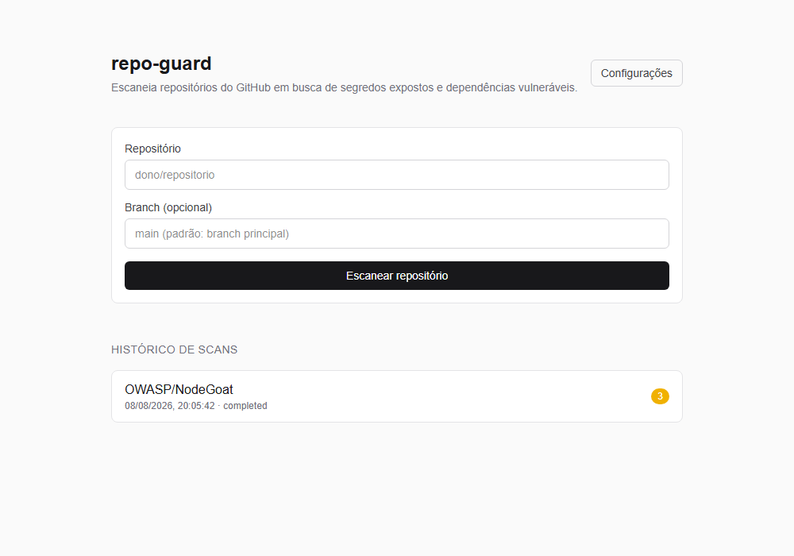
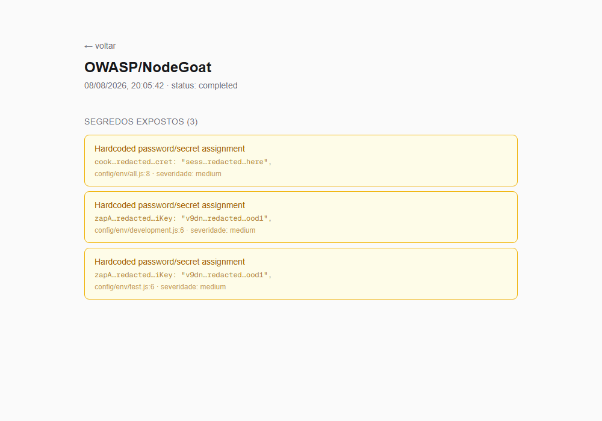

# repo-guard

[](https://github.com/fellipuscampos/repo-guard/actions/workflows/ci.yml)

Demo ao vivo: [repo-guard-gamma.vercel.app](https://repo-guard-gamma.vercel.app)

Escaneia um repositório do GitHub em busca de segredos expostos no código, como chaves AWS, tokens do GitHub, Slack, Stripe, Google, blocos de chave privada, senhas hardcoded e JWTs. Também verifica se as dependências npm do repositório (via `package-lock.json`) têm vulnerabilidades conhecidas, cruzando com a base pública de advisories do OSV.dev.

Os resultados ficam num dashboard simples, agrupados por severidade.





## Stack

Next.js (App Router), TypeScript, Tailwind CSS, Prisma (Postgres via Neon), Octokit e a API do OSV.dev.

## Rodando localmente

Precisa de um banco Postgres. O jeito mais rápido é criar um gratuito em [neon.tech](https://neon.tech).

```bash
npm install
cp .env.example .env   # cole sua connection string do Postgres em DATABASE_URL
npx prisma migrate deploy
npm run dev
```

Abra [http://localhost:3000](http://localhost:3000).

### Token do GitHub (opcional, mas recomendado)

Sem token, o app só consegue escanear repositórios públicos e esbarra rápido no limite de 60 requisições por hora da API do GitHub. Para escanear repositórios privados e evitar o rate limit:

1. Crie um [fine-grained personal access token](https://github.com/settings/tokens?type=beta) com permissão de leitura em `Contents`.
2. Cole o token na tela de configurações do app (`/settings`).

O token fica salvo no banco, que nunca é commitado.

## Como funciona

1. Você informa `dono/repositorio` na tela inicial.
2. O app busca a árvore de arquivos via API do GitHub e filtra arquivos de texto até 200KB, ignorando `node_modules`, `dist`, `.git` e afins.
3. Cada arquivo é varrido por padrões de regex que identificam formatos comuns de segredo.
4. Se existir `package-lock.json`, os pacotes e versões são extraídos e consultados em lote na API do OSV.dev.
5. Os achados são salvos no banco e exibidos na página do scan.

## Testes

```bash
npm run test
```

Cobre o parser de segredos e o de dependências vulneráveis (`src/lib/secret-scan.test.ts` e `src/lib/dependency-scan.test.ts`).

## Limitações conhecidas

A detecção de segredos é baseada em regex, então cobre os padrões mais comuns mas não é tão completa quanto ferramentas dedicadas como gitleaks ou trufflehog. A checagem de dependências só suporta o ecossistema npm, sem cobertura para pip, go.mod e outros. É uma ferramenta de uso pessoal e demonstração, não foi projetada para múltiplos usuários simultâneos.
